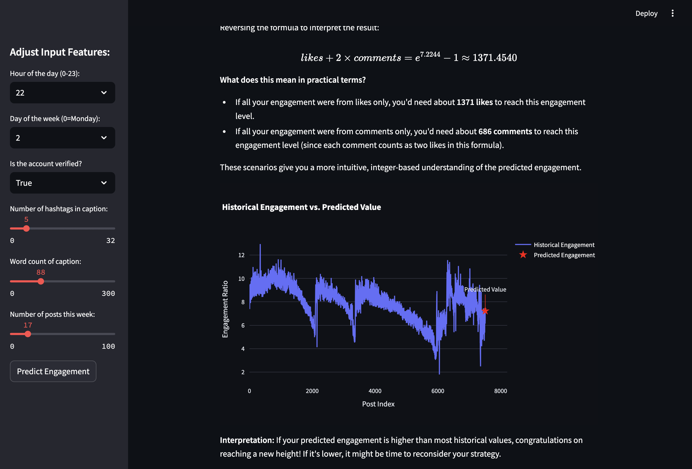

# Engagement Prediction App 📚📈

## Overview

This app helps educational content creators optimize their Instagram engagement by analyzing historical data and providing predictions based on factors like posting time, hashtag usage, and posting frequency.

## Demo
[View the App](https://bereketdeneke-socialengagement-optimizer-app-zz6z53.streamlit.app/)

## Features

- **Predict Engagement**: Predicts engagement ratio using a trained machine learning model.
- **Interpretation**: Converts predictions into approximate `likes` and `comments` for actionable insights.
- **Visualization**: Interactive graph comparing predicted engagement to historical data.
- **Custom Inputs**: Allows users to experiment with different posting times, hashtags, and more.

## Installation

1. Clone this repository:
   ```bash
   git clone https://github.com/bereketDeneke/socialEngagement-optimizer.git
   cd socialEngagement-optimizer
   ```

2. Create a virtual environment and activate it:
   ```bash
   python3 -m venv venv
   source venv/bin/activate  # On Windows: venv\Scripts\activate
   ```

3. Install dependencies:
   ```bash
   pip install -r requirements.txt
   ```

4. Start the app:
   ```bash
   streamlit run app.py
   ```

5. Access the app in your browser at `http://localhost:8501`.

## How to Use

1. **Input Features**: Use the sidebar to set:
   - Posting hour and day of the week.
   - Number of hashtags.
   - Word count of the caption.
   - Weekly post count.
   - Account verification status.

2. **View Predictions**:
   - Predicted engagement ratio.
   - Equivalent weighted engagement value (`likes + 2 × comments`).

3. **Visual Insights**:
   - Compare predicted engagement with historical data.

## Data

The app uses a dataset of ~7,500 Instagram posts/reels with features:
- Engagement: `likes`, `comments`, `engagement_ratio`.
- Timing: `hour`, `day_of_week`.
- Account Info: `is_verified`.
- Derived: `num_hashtags`, `word_count`, `posts_per_week`.

---

## Tech Stack

- **Streamlit**: Frontend framework for interactive apps.
- **Scikit-learn**: Random Forest model for engagement prediction.
- **Pandas & NumPy**: Data manipulation and preprocessing.
- **Plotly**: Interactive visualizations.

## Project Structure

```
engagement-prediction-app/
├── data/
│   ├── instagram_posts.csv
│   ├── instagram_reels.csv
├── app.py                  # Main application file
├── app.ipynb               # Notebook 
├── requirements.txt        # Dependencies
├── README.md               # Documentation
```

## Limitations

- Static model: Predictions are based on pre-trained data.
- Generalized recommendations: May not capture account-specific nuances.
